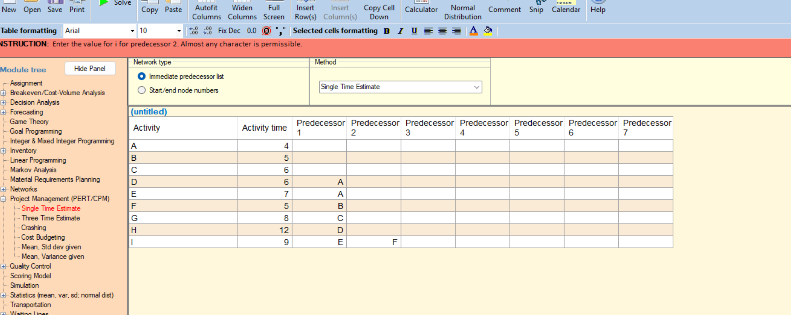

3 trụ : Cost - Time - Quality
- Cost : Chi phí
- Time : Thời gian
- Quality : Chất lượng
- **Phương pháp 3C** : Cost - Time - Quality
- Phân chia dự án thành các mục 

How to build a project plan
1.Duration of project
2.Critical activities

Can see that : Buoi_1/Bai_Tap/process.png.

Trong ảnh 2/png các slack (Thời gian trễ của nhiệm) là có thê rlaays late - early
